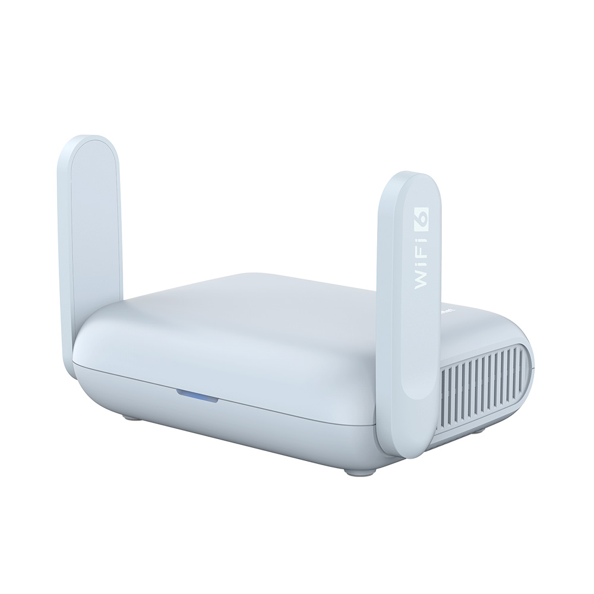

# gl-sdk4-plugin-kit

Unofficial toolkit for building native SDK4 admin panel plugins for GL.iNet routers.

[](https://www.gl-inet.com/products/gl-mt3000/)

Reference hardware used for live validation: **GL.iNet Beryl AX (GL-MT3000)**.
Product photo source: [GL.iNet](https://www.gl-inet.com/products/gl-mt3000/).

GL.iNet routers run an SDK4 Vue.js admin UI on top of OpenWrt. GL.iNet publishes firmware build tooling and prebuilt SDK4 packages, but no complete extension SDK for adding native admin pages. This project documents the package contract and automates building, testing, and deploying compatible plugins.

## How It Works

GL.iNet's admin panel loads plugins dynamically:

1. **Menu entries** are JSON files in `/usr/share/oui/menu.d/` on the router
2. **Views** are webpack-bundled Vue 2 components in `/www/views/gl-sdk4-ui-{name}.common.js.gz`
3. The app fetches the JS bundle, runs `eval()`, and mounts the Vue component

This toolkit automates the entire workflow: scaffold, validate, build, inspect,
deploy, and install.

The supported runtime starts at GL.iNet firmware 4.8. Router-changing commands
fingerprint the exact admin bundle and reject unknown firmware by default. Support
requires a verified model, normalized firmware version, and bundle SHA-256 tuple;
it is not inferred from a model name or a `4.x` version string.

## Quick Start

```bash
# Install the CLI
npm install --global gl-sdk4-plugin-kit

# Create a UI-only plugin (default)
glplugin init my-plugin

# Or create a package with router-side files and lifecycle hooks
glplugin init my-router-tool --profile full-stack

# Prepare it
cd my-plugin
npm install

# Add a second page under the plugin's main menu item
glplugin view add details --title "Details"

# Save a project-local router alias (no password is stored)
glplugin target add beryl root@192.168.8.1 --use

# Validate, build, package, upload, and install
glplugin check
glplugin install
```

Open your router's admin panel and refresh — your plugin appears in the sidebar.

### Development loop

```bash
glplugin deploy --build
glplugin dev

# Or inspect/install an existing package artifact
glplugin build
glplugin package
glplugin inspect dist/gl-sdk4-ui-my-plugin_1.0.0_all.ipk
glplugin install --no-build
glplugin uninstall
```

## CLI Commands

| Command | Description |
|---------|-------------|
| `glplugin init <name> [--profile ui-only\|full-stack]` | Scaffold a UI-only or full-stack plugin project |
| `glplugin view add\|list\|remove` | Manage the plugin's Vue pages and menu entries |
| `glplugin compatibility capture\|verify` | Capture redacted metadata and verify it against the matching admin bundle |
| `glplugin check [--strict]` | Validate project files, hooks, and toolchain |
| `glplugin capabilities` | List valid manifest capability IDs and read-only RPC probes |
| `glplugin build` | Build plugin (webpack + gzip) |
| `glplugin package` | Create `.ipk` package (installable via opkg, survives reboots) |
| `glplugin inspect <package.ipk>` | Inspect package metadata and file layout safely |
| `glplugin target <action>` | Add, select, list, show, or remove router aliases |
| `glplugin deploy [target\|host] [--build]` | Preflight the router, then optionally build and deploy UI assets via SCP |
| `glplugin install [target\|host]` | Check, build, package, preflight, upload, and opkg install |
| `glplugin uninstall [target\|host]` | Remove the project package from a router |
| `glplugin dev [target\|host]` | Watch, rebuild, and deploy UI changes |
| `glplugin test [target\|host]` | Test plugin and capability connectivity against a router |
| `glplugin doctor [target\|host]` | Detect model, firmware, auth algorithm, and read-only capabilities |
| `glplugin extract [target\|host] [--insecure-host-key]` | Extract firmware evidence via SSH |
| `glplugin extract <ip> --rpc [--password-stdin] [--include-sensitive]` | Discover API endpoints via RPC (no SSH needed) |
| `glplugin extract <host> --full` | Both SSH + RPC extraction |
| `glplugin <command> --help` | Show command help without executing it |

All commands support `--cwd`; finite commands support `--json`, `--quiet`, and
`--verbose`. See the [CLI workflow reference](docs/cli.md) for targets, precedence,
machine output, and exit codes.

### Router authentication and doctor

This authentication is only for developer-side CLI commands such as `doctor`, `test`, and RPC extraction. A plugin page loaded inside the GL.iNet admin UI continues to use the existing admin session and does not show a second login.

Router passwords are never accepted as positional CLI arguments. Interactive commands use a hidden TTY prompt; automation can provide one password line on stdin:

```bash
glplugin doctor 192.168.8.1
printf '%s\n' "$ROUTER_PASSWORD" | glplugin doctor 192.168.8.1 --password-stdin --json
```

The CLI negotiates `challenge.alg` instead of assuming MD5 crypt. Algorithms `1` (MD5 crypt), `5` (SHA-256 crypt), and `6` (SHA-512 crypt) are supported because all three are implemented by the official 4.8.1 and 4.9.0 UI bundles. Unknown algorithms fail explicitly.

HTTP remains the default for local router access. For HTTPS, certificate verification is enabled by default:

```bash
glplugin doctor router.local --https
glplugin doctor router.local --https --insecure # explicit opt-out for a self-signed certificate
```

`doctor` fingerprints the exact admin bundle, enforces the firmware 4.8 minimum,
and calls only read methods. Inside a plugin project it also enforces
`compatibility.requiredCapabilities`. Missing optional modules remain informational;
missing required modules fail the project check. An unknown model, firmware, and
bundle tuple does fail compatibility unless `--allow-unverified` is supplied
explicitly.

`test` uses the same feature-gated capability catalog as `doctor`, verifies the
project view through `ui.get_menu_list`, downloads the deployed bundle, and checks
its Vue export. It does not print any part of the session ID.

SSH commands use argument arrays without a local shell. New host keys are accepted
once and then checked on later connections. `--insecure-host-key` disables this
verification explicitly; use it only for disposable development routers whose host
key cannot be persisted. Multi-step commands reuse one temporary OpenSSH connection;
`dev` keeps it for the watcher lifetime, so rebuilds do not prompt again.

## Plugin Structure

```
my-plugin/
├── gl-plugin.json        # Plugin/package manifest
├── src/
│   └── index.vue          # Your Vue component
├── i18n/                  # Plugin translations
├── menu.json              # Menu entry definition
├── webpack.config.js      # Build config (pre-configured)
├── package.json
└── dist/                  # Build output
    └── gl-sdk4-ui-my-plugin.common.js.gz
```

## Writing Plugins

Your plugin is a standard Vue 2 single-file component. RPC failures reject normally, so handle them explicitly:

```vue
<template>
  <div>
    <gl-title :title="'My Plugin'" />
    <gl-card>
      <p>{{ model }} - {{ uptime }}</p>
      <p v-if="error">{{ error }}</p>
      <gl-button type="primary" @click="fetchData">Refresh</gl-button>
    </gl-card>
  </div>
</template>

<script>
export default {
  name: 'my-plugin',
  data() {
    return { model: '', uptime: '', error: '' };
  },
  created() {
    this.fetchData();
  },
  methods: {
    async fetchData() {
      this.error = '';
      try {
        const info = await this.$rpcRequest('call', ['sid', 'system', 'get_info', {}]);
        const status = await this.$rpcRequest('call', ['sid', 'system', 'get_status', {}]);
        this.model = info.board_info.model;
        const s = status.system.uptime;
        this.uptime = Math.floor(s/3600) + 'h ' + Math.floor(s%3600/60) + 'm';
      } catch (error) {
        this.error = error.message || 'RPC request failed';
      }
    },
  },
};
</script>

<style scoped>
p { color: var(--text-color); }
</style>
```

## Node.js API Client

Control your router from scripts without SSH:

```bash
npm install gl-sdk4-plugin-kit
```

```js
const { createClient } = require('gl-sdk4-plugin-kit/lib/api-client');

const client = await createClient('192.168.8.1', 'your-password');

// Read
const info = await client.system.getInfo();
const clients = await client.clients.getList();
const vpn = await client.vpnClient.getStatus();

// Write
await client.wifi.setConfig({ ... });
await client.firewall.addPortForward({ name: 'SSH', proto: 'tcp', dest_ip: '192.168.8.100', dest_port: '22', src_dport: '2222' });

// VPN control (use set_tunnel, not stop)
const tunnels = await client.vpnClient.getTunnel();
tunnels.tunnels[0].enabled = false;
await client.rpc('vpn-client', 'set_tunnel', tunnels.tunnels[0]); // disable
tunnels.tunnels[0].enabled = true;
await client.rpc('vpn-client', 'set_tunnel', tunnels.tunnels[0]); // re-enable
```

## Vue API Mixin

Install the toolkit as a build-time dependency when importing its API mixin. Webpack
includes the API factory and catalog in the plugin bundle, so the router does not
need the Node package at runtime.

For reference, the full mixin provides 49 namespaces with 326 methods. Calls preserve RPC rejections instead of converting failures to `null`:

```js
const { glApiMixin } = require('gl-sdk4-plugin-kit/lib/api');

export default {
  mixins: [glApiMixin],
  async created() {
    const info = await this.glApi.system.getInfo();
    const clients = await this.glApi.clients.getList();
  }
};
```

## Package Configuration

`gl-plugin.json` is the single source for the plugin ID, profile, OpenWrt package
metadata, filesystem overlay, and lifecycle hooks. `package.json` remains the
Node/build manifest.

```json
{
  "schemaVersion": 1,
  "id": "my-plugin",
  "profile": "full-stack",
  "views": [
    { "id": "my-plugin", "entry": "src/index.vue", "menu": "menu.json" },
    { "id": "my-plugin-tools", "entry": "src/tools.vue", "menu": "menus/tools.json" }
  ],
  "compatibility": {
    "minimumFirmware": "4.8.0",
    "requiredComponents": ["gl-card", "gl-title"],
    "requiredCapabilities": ["wifi", "repeater"]
  },
  "package": {
    "name": "gl-sdk4-ui-my-plugin",
    "architecture": "all",
    "depends": ["libc", "gl-sdk4-ui-core"],
    "section": "base",
    "conffiles": ["/etc/config/my-plugin"]
  },
  "overlay": "overlay",
  "lifecycle": {
    "postinst": "hooks/postinst",
    "prerm": "hooks/prerm"
  }
}
```

The default `ui-only` profile packages the admin view, menu, and translations.
`full-stack` additionally copies `overlay/` into the router root filesystem,
supports package dependencies and conffiles, and validates POSIX shell lifecycle
hooks. The optional `views` array packages multiple native pages; omitting it
keeps the single `src/index.vue` plus `menu.json` convention. Existing
pre-manifest projects using `package.json.pluginName/glPlugin`
remain readable through a legacy adapter.

Use `glplugin view add <id>` to create a child page under the primary menu item,
or pass `--top-level` to create an independent top-level page. `glplugin view list`
shows the declared pages. `glplugin view remove <id>` updates the manifest but
keeps source and menu files unless `--delete-files` is explicitly supplied. Short
IDs are automatically namespaced: in `my-plugin`, `view add details` declares the
globally safe view ID `my-plugin-details` while keeping `src/details.vue`.

`glplugin package` also writes `Installed-Size`, `SourceName`,
`X-GL-Firmware-Min`, `X-GL-UI-Contract`, and the standard OpenWrt lifecycle
wrappers. Menu files are package-owned and are not marked as `conffiles`. See
[Package Manifest and Profiles](docs/packaging.md) for the full contract.

## Documentation

- [Components Reference](docs/components.md) — 52 verified UI components on firmware 4.8.1 and the 4.9.0 beta6 delta
- [CLI Workflow](docs/cli.md) - targets, check/build/install/dev workflows, JSON output, and exit codes
- [API Reference](docs/api.md) — RPC calls and backend communication
- [Firmware Compatibility](docs/compatibility.md) - inspected firmware artifacts, auth contract, and doctor behavior
- [Package Manifest and Profiles](docs/packaging.md) - UI/full-stack packaging, overlays, conffiles, and lifecycle hooks
- [CLI Security](docs/cli-security.md) - Authentication, SSH host keys, and extraction redaction
- [Menu Format](docs/menu.md) — How to define menu entries
- [Theme Variables](docs/theme.md) — CSS variables for native look and feel
- [Extracted API Methods](docs/api-methods.md) - 302 methods found in the inspected firmware bundle
- [Runtime API Catalog](lib/api-catalog.js) - 49 namespaces and 326 callable method mappings
- [Type Definitions](lib/types.js) - JSDoc response and parameter types
- [Write Methods - VPN](docs/write-methods-vpn.md) - VPN write method parameters
- [Write Methods - Network](docs/write-methods-network.md) - Network and firewall parameters
- [Write Methods - System](docs/write-methods-system.md) - System and service parameters
- [Vue API Mixin](lib/api.js) - Browser API generated from the shared catalog
- [Node.js Client](lib/api-client.js) - Standalone API generated from the same catalog

## Examples

- [hello-world](examples/hello-world/) — Minimal plugin showing device info
- [network-info](examples/network-info/) — Plugin with tables and multiple cards

## Extract Components from Any Firmware

If you're running a different firmware version, extract fresh component data:

```bash
glplugin extract root@192.168.8.1
glplugin extract 192.168.8.1 --rpc
```

This SSHs into the router, downloads `app.js`, computes its SHA-256 fingerprint,
and resolves its component registry against runtime-verified firmware catalogs. It
also extracts CSS variables, icons, and RPC signatures into
`extracted-components.json`. Unknown bundle fingerprints are reported as unknown;
literal registration signals are diagnostic only and are never presented as a
complete global component list.

RPC extraction also records successful method response shapes. Fields that can hold
passwords, tokens, or private keys are replaced with `<redacted>` by default. Use
`--include-sensitive` only when raw local output is required, and never commit or
share that output.

## Compatibility Status

- GL-MT3000 4.8.1 release: live supported.
- GL-AXT1800 4.8.3 release: official artifact verified.
- GL-SFT1200 4.8.3 release: official artifact verified.
- GL-MT6000 4.9.1 release: official artifact verified.

GitHub Actions downloads these exact official images and verifies their published
SHA-256, SquashFS package layout, auth/runtime contract, static component signals,
runtime registry snapshots where available, `opkg`, menu layout, and lifecycle dispatch. New bundle fingerprints remain
blocked until added to the catalog. See [the compatibility notes](docs/compatibility.md)
for the exact matrix and validation boundary.

To inspect a modern but unknown tuple without editing the catalog:

```bash
glplugin doctor 192.168.8.1 --allow-unverified --json > doctor.json
glplugin compatibility capture doctor.json
glplugin compatibility verify compatibility-candidate.json --bundle admin-app.js.gz
```

The candidate contains only normalized router/runtime evidence and omits the target,
hostname, authentication data, capabilities, and raw RPC responses. A successful
verification means the candidate and supplied bundle agree and are `ready-for-review`,
not supported; runtime registry capture, catalog changes, and firmware
artifact verification remain manual.

## Disclaimer

This is an unofficial, community-driven project. It is not affiliated with, endorsed by, or supported by GL.iNet. Component documentation was obtained through reverse engineering of the publicly accessible admin panel JavaScript. No proprietary source code is included in this repository.

## Contributing

See [CONTRIBUTING.md](CONTRIBUTING.md) before opening a pull request. A new component catalog must include the decompressed bundle
SHA-256 and a runtime inspection of `Vue.options.components`. Do not infer the global
registry from bundle strings. Submitted extraction output must be manually reviewed
and redacted.

## License

MIT
